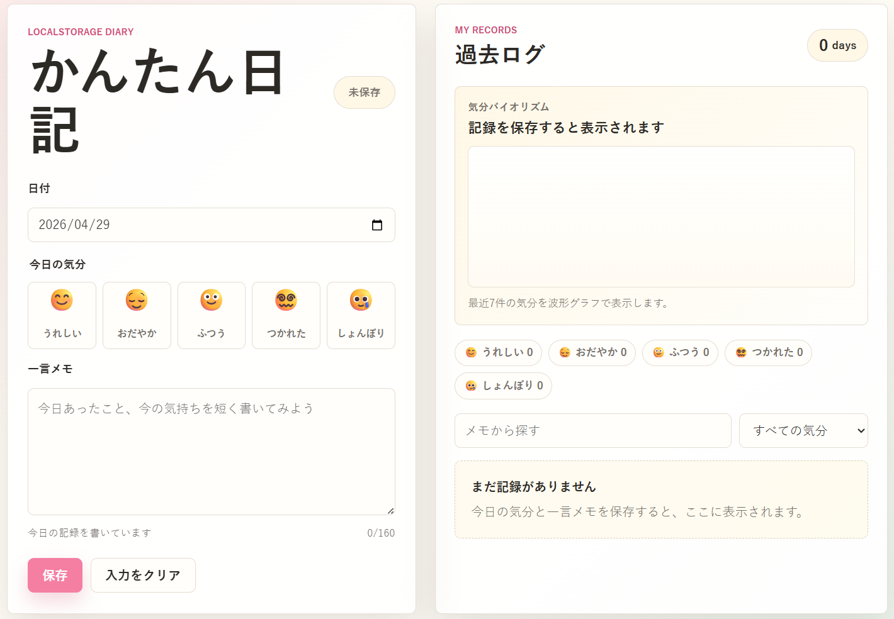

# 学習ログ

学習したことと、その日の学習時の調子を記録して振り返るアプリです。

HTML/CSS/JavaScriptとlocalStorageだけで動きます。日付ごとに「今日の調子」と「今日の学習メモ」を保存し、あとから学習記録を見返せます。記録はブラウザのlocalStorageに残ります。

## 📱 デモ

🔗 [https://hakuro21.github.io/my-study-log/](https://hakuro21.github.io/my-study-log/)



## デモの動かし方

`index.html` をブラウザで開くだけで使えます。ビルドやサーバー起動は不要です。

```text
my-study-log/
├── index.html
├── styles.css
├── app.js
├── README.md
└── LICENSE
```

## 機能

- 今日の日付を自動セット
- 学習時の調子を5種類から選択
- 今日の学習メモを保存
- 日付ごとに1件の記録として保存
- 同じ日付で保存すると上書き
- 保存した学習記録の一覧表示
- 保存済みログの編集
- 保存済みログの削除
- メモ検索
- 調子フィルター
- 最近7件の学習時の調子を表示するグラフ
- スマートフォンで入力欄と最近の学習記録を見渡せるレイアウト

本名・学校名・クラス名など、個人が分かる情報は記録しないでください。
記録例：数学の一次関数を10問解いた、英単語を15語復習した、読書メモを3行書いた。

## 使用技術

- HTML
- CSS
- JavaScript
- localStorage

外部ライブラリは使っていません。

## localStorage

保存キーは `tiny-diary.entries.v1` です。

データは次のような配列で保存されます。

```json
[
  {
    "id": "example-id",
    "date": "2026-04-29",
    "mood": "happy",
    "note": "数学の一次関数を10問解いた",
    "createdAt": "2026-04-29T10:00:00.000Z",
    "updatedAt": "2026-04-29T10:00:00.000Z"
  }
]
```

## 調子データ

学習時の調子は次の5種類です。

| 値 | 表示 | スコア |
| --- | --- | --- |
| `happy` | 集中できた | 5 |
| `calm` | まあまあ | 4 |
| `normal` | ふつう | 3 |
| `tired` | 少し疲れた | 2 |
| `sad` | 休みたい | 1 |

最近7件の記録をこのスコアに変換して、SVGの波形グラフとして表示します。

## 教材で説明しやすい流れ

1. フォームから値を受け取る
2. JavaScriptの配列に学習記録を追加する
3. `JSON.stringify` でlocalStorageへ保存する
4. `JSON.parse` でlocalStorageから読み込む
5. 配列をもとに学習記録と調子のグラフを再描画する

## ファイル構成

- `index.html`: 画面の構造
- `styles.css`: レイアウトと見た目
- `app.js`: 保存、表示、編集、削除、検索、調子のグラフ描画
- `README.md`: この説明ファイル
- `LICENSE`: MITライセンス

## ライセンス

MIT License
